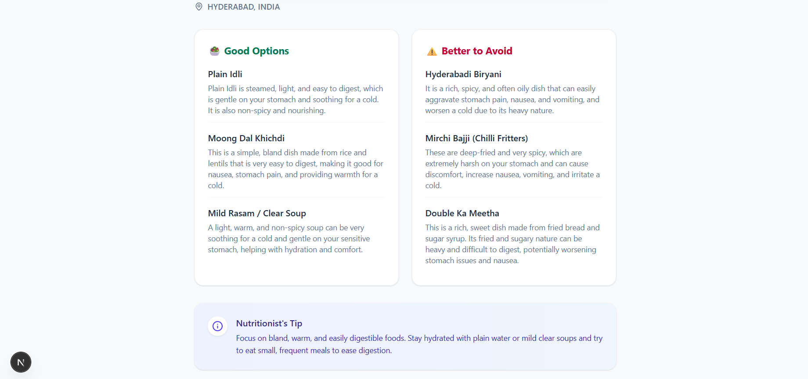

# 🥗 NutriGuide

**NutriGuide** is an AI-powered nutrition assistant that helps users make safer food choices based on their **location**, **health conditions**, and **dietary preferences**.

Built with **Next.js 14**, **TypeScript**, and **Google Gemini AI**, it acts as a local food guide, analyzing whether specific dishes are suitable for you or if they should be avoided.

---

##  Features

- Location-Aware Analysis: Uses AI to identify and analyze local foods specific to any country, state, or city.
- Health-Centric: Tailors recommendations based on user conditions (e.g., Diabetes, Hypertension, Gluten Intolerance).
- Specific Food Check: Allows users to search for specific dishes (e.g., "Samosa", "Pasta Carbonara") to see if they are safe.
- Smart Categorization: Automatically sorts foods into "Good to Eat" and "Better to Avoid" lists.
- Fast & Responsive: Built with Next.js App Router and Tailwind CSS for a seamless mobile and desktop experience.

---

##  Tech Stack

- **Framework**: [Next.js 14](https://nextjs.org/) (App Router)
- **Language**: [TypeScript](https://www.typescriptlang.org/)
- **Styling**: [Tailwind CSS](https://tailwindcss.com/)
- **Animations**: [Framer Motion](https://www.framer.com/motion/)
- **AI Model**: [Google Gemini](https://ai.google.dev/) (`gemini-pro` / `gemini-1.5-flash`)
- **Icons**: [Lucide React](https://lucide.dev/)

---

##  Getting Started

Follow these steps to set up the project locally.

### Prerequisites

- Node.js 18.17 or later
- A Google Cloud / Gemini API Key ([Get one here](https://aistudio.google.com/))

### Installation

1. **Clone the repository**
   ```bash
   git clone [https://github.com/Karthikeyanhimself/AI-Powered-Nutrition-Guide](https://github.com/Karthikeyanhimself/AI-Powered-Nutrition-Guide)
   cd nutri-guide
2. **Install dependencies**
   ```bash
   npm install
   ```

3. **Set up environment variables**
   ```bash
   touch .env.local
   ```

   ```env
   GOOGLE_API_KEY=your_actual_api_key_here
   ```

4. **Run the development server**
   ```bash
   npm run dev
   ```

5. **Open the app**

   Visit:
   ```
   http://localhost:3000
   ```

---

##  Project Structure

```text
nutri-guide/
├── app/
│   ├── api/analyze-food/
│   ├── globals.css          
│   ├── layout.tsx          
│   └── page.tsx             
├── components/
│   ├── ui/                  
│   ├── NutritionForm.tsx    
│   ├── ResultsDisplay.tsx   
│   └── ResultsSkeleton.tsx  
├── lib/                    
├── types/                   
└── public/                
```
---

## 📸 Screenshots



